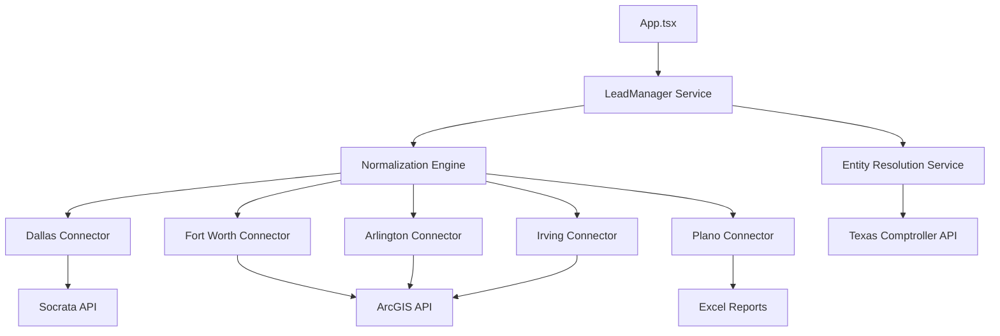

# Lead Sourcing Implementation Plan

## 1. Executive Summary
This plan details the technical steps to transition the "FinishOutNow" application from static mock data to a fully functional, multi-source lead generation engine. The goal is to implement the "Automated Lead Sourcing Engine (ALSE)" described in the requirements, adapted for the current TypeScript/React application architecture.

## 2. Current Status
- **Frontend:** Functional React Dashboard with filtering and sorting.
- **AI Analysis:** Implemented via `geminiService.ts` (Google GenAI).
- **Data Source:** Currently using `MOCK_PERMITS` in `mockData.ts`.
- **Missing:** Real-time connections to Dallas, Fort Worth, Arlington, Plano, and Irving data sources; Entity Resolution; and Data Normalization.

## 3. Architecture Design
We will expand the `services` directory to include a modular ingestion layer.

## 4. Implementation Phases

### Phase 1: Core API Connectors (Tier 1)
**Goal:** Ingest live data from "Free & Open" APIs (Dallas, Fort Worth, Arlington).

#### 1.1 Dallas Connector (`services/ingestion/dallas.ts`)
- **Source:** Dallas Open Data (Socrata)
- **Endpoint:** `https://www.dallasopendata.com/resource/e7gq-4sah.json`
- **Tasks:**
    - Implement SODA API fetcher.
    - Filter for `permit_type` (BU Commercial New, BU Commercial Alteration).
    - Map fields to `Permit` interface.

#### 1.2 Fort Worth Connector (`services/ingestion/fortWorth.ts`)
- **Source:** Fort Worth Open Data (ArcGIS)
- **Endpoint:** `https://data.fortworthtexas.gov/resource/qy5k-jz7m.json` (Mirror) or ArcGIS FeatureServer.
- **Tasks:**
    - Handle schema differences (Permit_Type vs SubType).
    - Filter for Status: 'Applied' or 'Issued'.

#### 1.3 Arlington "Golden Hour" Connector (`services/ingestion/arlington.ts`)
- **Source:** Arlington Open Data (ArcGIS)
- **Endpoint:** ArcGIS FeatureService (Permit Applications).
- **Tasks:**
    - Fetch "Permit Applications" (Pre-issued).
    - Filter for "In Review" or "Payment Pending".

### Phase 2: Complex Ingestion (Tier 2 & Normalization)
**Goal:** Handle non-API sources and standardize data.

#### 2.1 Normalization Engine (`services/normalization.ts`)
- **Tasks:**
    - Create a unified `RawPermit` type for each source.
    - Implement mapping logic to convert city-specific status/types into the app's `LeadCategory` and standard `Permit` interface.
    - Standardize dates to ISO format.

#### 2.2 Plano Excel Parser (`services/ingestion/plano.ts`)
- **Source:** Plano Building Inspections (Weekly Excel).
- **Tasks:**
    - Implement a fetcher for the `.xlsx` files.
    - Use a library like `xlsx` or `sheetjs` to parse binary data in the browser/node.
    - Extract "Commercial Building" and "Interior Finish Out" sheets.

#### 2.3 Irving Connector (`services/ingestion/irving.ts`)
- **Source:** Irving ArcGIS Hub.
- **Tasks:**
    - Connect to Commercial Permits Issued layer.

### Phase 3: Entity Resolution & Enrichment
**Goal:** Turn "Company Name" into "Contactable Lead".

#### 3.1 Texas Comptroller Integration (`services/enrichment/comptroller.ts`)
- **Source:** TX Comptroller Franchise Tax API.
- **Tasks:**
    - Implement `lookupEntity(name: string)`.
    - Fuzzy match results.
    - Extract `taxpayerId` and `mailingAddress`.

### Phase 4: Integration & UI Updates
**Goal:** Display live data in the Dashboard.

#### 4.1 Lead Manager Service
- Create `services/LeadManager.ts` to orchestrate all connectors.
- Implement `fetchAllLeads()` which aggregates data from all sources.

#### 4.2 UI Changes
- Update `App.tsx` to call `LeadManager` instead of importing `MOCK_PERMITS`.
- Add a "Source" column or filter to the Dashboard.
- Add visual indicators for "Verified" leads (matched against Comptroller).

## 5. Next Steps (Immediate Todo)
1. Install necessary dependencies (e.g., `axios` for fetching, `xlsx` for parsing).
2. Create the `services/ingestion` directory structure.
3. Begin implementation of **Phase 1: Dallas Connector**.